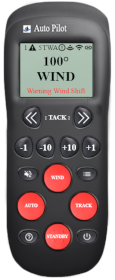

# signalk-autopilot

<p align="center"></p>

`signalk-autopilot` is composed of 2 modules:
- [A graphical interface that emulates a Raymarine remote control](./GUI-help.md "GUI help")  
To be able to acknowledge pilot related alarms through the GUI you need to install the `signalk-alarm-silencer` plugin.  
- A back-end API described below.

**To get the plugin to work in KIP, disable the V2 API in the plugin config.**

Supports 
- Raymarine NMEA 2000
- Seatalk 1 Autopilots
- Simrad Autopilots (currently only tested with a NAC-3), not support yet to set target heading or wind angle, only increment and decriment them. Requires SK Server 2.17.x

For Seatalk 1 Autopilots to work, a device that can translate Seatalk datagrams back and forth within an NMEA0183 sentence is required. They may be purchased from [Digital Yacht](https://digitalyachtamerica.com/product/st-nmea-usb/), [Shipmodul (Miniplex 3)](http://www.shipmodul.com/en/index.html) or [gadgetpool](http://www.gadgetpool.eu/product_info.php?products_id=54). For an example guide, see [TinyNMEA-USB.md](TinyNMEA-USB.md)

Also, signalk-to-nmea0183 plugin with APB (for route control) and MWV (for wind steer) should be enabled.

# Current State

The current state of the autopilot can be found at the following paths:

- steering.autopilot.target.headingMagnetic
- steering.autopilot.target.windAngleApparent
- steering.autopilot.state (standby, wind, route, or auto)
- steering.autopilot.hullType (Raymarine n2k only, unknown, sailSlowTurn, sail, sailCatamaran, power, powerSlowTurn, powerFastTurn)

# API

All messages to plugin are done using PUT requests. These can be done via HTTP or over WebSockets.

Detailed info on [PUT](https://signalk.org/specification/1.3.0/doc/put.html) and [Request/Response](https://signalk.org/specification/1.3.0/doc/request_response.html)

Http:

```
PUT http://localhost:3000/signalk/v1/api/vessels/self/steering/autopilot/target/headingMagnetic
{
  "value": 88,
}
```

WebSockets:

```
{
  "context": "vessels.self",
  "requestId": "184743-434373-348483",
  "put": {
    "path": "steering.autopilot.target.headingMagnetic",
    "value": 88
  }
}
```


## Advance Waypoint
```
PUT http://localhost:3000/signalk/v1/api/vessels/self/steering/autopilot/actions/advanceWaypoint
{
  "value": 1,
}
```

## Set Autopilot State

The `value` can be `auto`, `wind`, `route`, or `standby`

```
PUT http://localhost:3000/signalk/v1/api/vessels/self/steering/autopilot/state
{
  "value": "auto",
}
```

## Change Target Heading or Wind Angle

The `value` is in degrees and is the amount to change. So when in `auto` at a heading of 180, a value of `-10` will change the target heading would be changed to `170`

```
PUT http://localhost:3000/signalk/v1/api/vessels/self/steering/autopilot/actions/adjustHeading
{
  "value": -10,
}
```

## Tack to port or starboard

The `value` is `port` or `starboard`.

```
PUT http://localhost:3000/signalk/v1/api/vessels/self/steering/autopilot/actions/tack
{
  "value": "port",
}
```

## Target Heading

The `value` is the heading in degrees.

```
PUT http://localhost:3000/signalk/v1/api/vessels/self/steering/autopilot/target/headingMagnetic
{
  "value": 80,
}
```

## Target Wind Angle

The `value` is the wind angle in radians.

```
PUT http://localhost:3000/signalk/v1/api/vessels/self/steering/autopilot/target/windAngleApparent
{
  "value": 1.52,
}
```

## Hull Type (Raymarine N2K Only)

The `value` is the hull type.

```
PUT http://localhost:3000/signalk/v1/api/vessels/self/steering/autopilot/hullType
{
  "value": "power",
}
```

