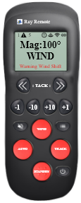

# signalk-raymarine-autopilot

[](https://greenkeeper.io/)

<p align="center"></p>

`signalk-raymarine-autopilot` signal is composed of 2 modules: 
- [A graphical interface that emulates a Raymarine remote control](./GUI-help.md "GUI help")
- A back-end API described below.

# API

All messages to plugin are done as POST requests which take a map as input in the form:

```json
{
  "action": "someAction",
  "value": 10
}
```

The POST should be sent to `/plugins/raymarineautopilot/command`

## Advance Waypoint
```json
{
  "action": "advanceWaypoint"
}
```

## Set Autopilot State

The `value` can be `auto`, `wind`, `route`, or `standby`

```json
{
  "action": "setState",
  "value": "auto"
}
```

## Change Target Heading or Wind Angle

The `value` is in degrees and is the amount to change. So when in `auto` at a heading of 180, a value of `-10` will change the target heading would be changed to `170`

```json
{
  "action": "changeHeading",
  "value": 1
}
```

## Change Target Heading or Wind Angle by key

The `value` is a direct key (`+1`, `+10`, `-1`, `-10`, `-1-10`, `+1+10`). 
The key `+1` add +1 degree to heading, `+10` add +10 degree... 
The special key `-1-10` and `+1+10` is dedicated to take a tack to port or starbord.

```json
{
  "action": "changeHeadingByKey",
  "value": "+1"
}
```

## Take a tack to port or starboard

The `value` is `port` or `starboard`. 
This command must be send only when your pilot is in `auto` or `wind` mode.

```json
{
  "action": "tackTo",
  "value": "port"
}
```

## Silence alarm

This command silence a Raymarine alarms. 
You can silence alarm directly by the numeric code or by a `signal k` notification path. 
This command does not silence a `signal k` notification. 
It is your Raymarine equipment that receives the acknowledgement command 
and returns a new notification status on the NMEA2000 bus with the `normal` state value. 
See the code in `index.js` for the complete list of `raymarineAlarmGroupCodes` and `alarmsId` keys / values. 
 
In acknowledgement by the numeric code, the `value` is : 

```json
{
  "action": "silenceAlarm",
  "value": {
    "groupId": "0x01",
    "alarmId": "0x47"
  }
}
```

In acknowledgement by `signal k` notification path, the `value` is the path you receive in your websocket : 

```json
{
  "action": "silenceAlarm",
  "value": {
    "signalkPath": "notifications.autopilot.PilotWarningWindShift"
  }
}
```
