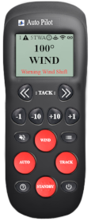

# signalk-autopilot

<p align="center"></p>

`signalk-autopilot` is composed of 2 modules:
- [A graphical interface that emulates a Raymarine remote control](./GUI-help.md "GUI help")  
To be able to acknowledge pilot related alarms through the GUI you need to install the `signalk-alarm-silencer` plugin.  
- A back-end API described below.

**To get the plugin to work in KIP, disable the V2 API in the plugin config.**

Supports 
- Raymarine NMEA 2000
- Seatalk 1 Autopilots
- Simrad Autopilots (currently only tested with a NAC-3), not support yet to set target heading or wind angle, only increment and decriment them. Requires SK Server 2.17.x

For Seatalk 1 Autopilots to work, a device that can translate Seatalk datagrams back and forth within an NMEA0183 sentence is required. They may be purchased from [Digital Yacht](https://digitalyachtamerica.com/product/st-nmea-usb/), [Shipmodul (Miniplex 3)](http://www.shipmodul.com/en/index.html) or [gadgetpool](http://www.gadgetpool.eu/product_info.php?products_id=54). For an example guide, see [TinyNMEA-USB.md](TinyNMEA-USB.md)

Also, signalk-to-nmea0183 plugin with APB (for route control) and MWV (for wind steer) should be enabled.

# Current State

The current state of the autopilot can be found at the following paths:

- steering.autopilot.target.headingMagnetic
- steering.autopilot.target.windAngleApparent
- steering.autopilot.state (standby, wind, route, or auto)
- steering.autopilot.hullType (Raymarine n2k only, unknown, sailSlowTurn, sail, sailCatamaran, power, powerSlowTurn, powerFastTurn)

# Emulator Route Mode

The emulator follows the original departure-to-destination track, including when
navigating to a single waypoint. It uses
`navigation.course.calcValues.bearingTrackTrue` (converted to magnetic) or
`bearingTrackMagnetic`, together with `crossTrackError`. It does not fall back to
the direct bearing from the vessel to the waypoint.

Converting the true track bearing requires a finite `navigation.magneticVariation`,
including zero. Otherwise, the emulator uses the magnetic track bearing if
available; it never treats a true bearing as a magnetic bearing.

Entering `route` requires a finite magnetic track bearing (direct or converted
from true) and cross-track error. If either is missing or invalid, the command
returns an error without changing the current mode or target. If this data becomes
unavailable while following the route, the emulator returns to `standby` and clears
its published heading target. Restoring the data does not automatically engage
route mode again.

| Property | Default | Description |
| --- | --- | --- |
| `routeXteLookahead` | 100 m | Lookahead distance along the track. An equal XTE gives a 45 degree correction before the maximum limit is applied. |
| `routeMaxXteCorrection` | 60 degrees | Maximum magnitude of the heading correction on either side of the track. |

# API

All messages to plugin are done using PUT requests. These can be done via HTTP or over WebSockets.

Detailed info on [PUT](https://signalk.org/specification/1.3.0/doc/put.html) and [Request/Response](https://signalk.org/specification/1.3.0/doc/request_response.html)

Http:

```
PUT http://localhost:3000/signalk/v1/api/vessels/self/steering/autopilot/target/headingMagnetic
{
  "value": 88,
}
```

WebSockets:

```
{
  "context": "vessels.self",
  "requestId": "184743-434373-348483",
  "put": {
    "path": "steering.autopilot.target.headingMagnetic",
    "value": 88
  }
}
```


## Advance Waypoint
```
PUT http://localhost:3000/signalk/v1/api/vessels/self/steering/autopilot/actions/advanceWaypoint
{
  "value": 1,
}
```

## Set Autopilot State

The `value` can be `auto`, `wind`, `route`, or `standby`

```
PUT http://localhost:3000/signalk/v1/api/vessels/self/steering/autopilot/state
{
  "value": "auto",
}
```

## Change Target Heading or Wind Angle

The `value` is in degrees and is the amount to change. So when in `auto` at a heading of 180, a value of `-10` will change the target heading would be changed to `170`

```
PUT http://localhost:3000/signalk/v1/api/vessels/self/steering/autopilot/actions/adjustHeading
{
  "value": -10,
}
```

## Tack to port or starboard

The `value` is `port` or `starboard`.

```
PUT http://localhost:3000/signalk/v1/api/vessels/self/steering/autopilot/actions/tack
{
  "value": "port",
}
```

## Target Heading

The `value` is the heading in degrees.

```
PUT http://localhost:3000/signalk/v1/api/vessels/self/steering/autopilot/target/headingMagnetic
{
  "value": 80,
}
```

## Target Wind Angle

The `value` is the wind angle in radians.

```
PUT http://localhost:3000/signalk/v1/api/vessels/self/steering/autopilot/target/windAngleApparent
{
  "value": 1.52,
}
```

## Hull Type (Raymarine N2K Only)

The `value` is the hull type.

```
PUT http://localhost:3000/signalk/v1/api/vessels/self/steering/autopilot/hullType
{
  "value": "power",
}
```
